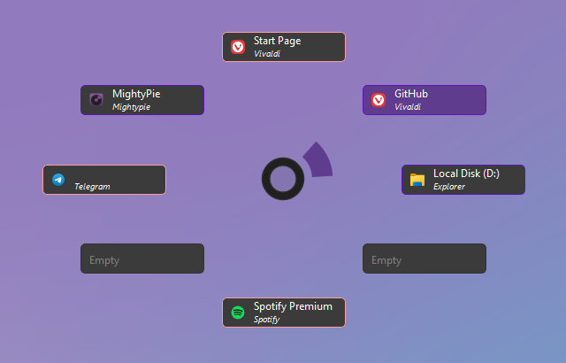
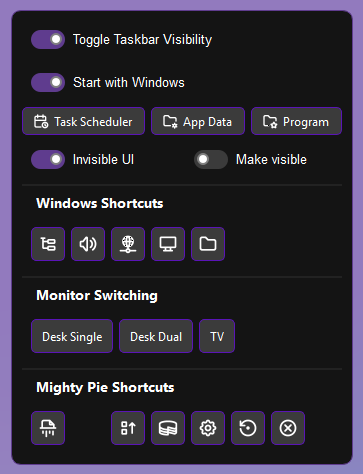

# MightyPie - Customizable Pie Menu

MightyPie started as a Window Switcher for Windows 11, inspired by Blender's pie menus. It now offers a few more useful functions.

[](https://ko-fi.com/rayzorblade23)



### Disclaimer

This is my first "real" program and there are almost certainly bugs and rough edges here and there, so use at your own discretion. MightyPie is functional, but I don't really plan on developing it into a full, polished release. I welcome feedback and contributions, but I may not actively maintain or expand the project beyond its current state.

There are also some functions I included specifically for myself, like _Left-click_ on the center button of a Pie Menu just executes "forwards". This is because in my setup opening Pie Menus uses the Forward button on my mouse.

## Features

*   **Multiple Pie Menus:** There are two Pie Menus with assignable hotkeys. Each has three layers of eight configurable buttons.

*   **Four Button Functionalities**
    - Show Any Window: shows any open window
    - Show Program Window: shows only windows of certain program, if none are open it launches the program instead
    - Launch Program: launches program
    - Call Function: select from a bunch of function, i.e. Play, Pause, Maximize under cursor etc.

*   **Special Menu:** Has even more shortcuts for Windows and for MightyPie itself. This is where the settings are.


### Usage

MightyPie works with a cache (App Info Cache) that holds the info (name, path, icon path) for all the programs the user has opened once. This cache is the working basis for all program-related buttons, i.e. their UI and launch paths

1.  **Run the application:** The program is portable so just run MightyPie.exe.


2.  **Configure Hotkeys:** The settings open at the first start. Here you can configure your hotkeys. (Default are F14 for the Primary Pie Menu and F13 for the Secondary Pie Menu. The hotkeys are keyboard only -- I use AHK to map my mouse buttons to keys.


3.  **Trigger the Pie Menu:** The Pie Menu opens on button-down. You can also hold the hotkey, hover over a button (or its section) and just release for triggering a button.


4.  **Pie Menu:** Use the mouse to select a button in the pie menu. 
    - _Left-click_ is the normal function.
    - _Middle-click_ on Show Window Buttons will close that window.
    - _Right-click_ anywhere will close the Pie Menu.
    - as stated in the [Disclaimer](#disclaimer), _Left-click_ on the Center Button of a Pie Menu executes "forward" action in most programs (it actually just triggers Alt + Right-Arrow)


5.  **Special Menu:** More Windows functions and settings.


 - _Middle-click_ the Center Button in any Pie Menu to open the Special Menu.
 - All the buttons have tool tips.


 - The Startup section is only visible when run with elevated privileges, which I recommend anyway, since MightyPie will otherwise not work when programs with elevated privileges are in the foreground (like Task Manager). "Start with Windows" creates (or removes) a task in the Task Scheduler, hence the shortcut there.


 - the Invisible UI right now consists of two buttons on the left edge and at the bottom of the screen respectively. The one on the left opens an explorer window and the one at the bottom toggles Taskbar visibility (just like the toggle in the menu)
 - in the App Data folder, you find json files which save the Button Config, the App Settings and the App Info Cache (you normally don't have to interact with those directly but if you have problems, try deleting these files to get reset the whole program).


 - the other unlabeled buttons are:
   - **Windows Shortcuts:** 
     - Open Task Manager
     - Open Sound Settings
     - Open Network Settings
     - Open Projection Settings (monitor switching)
     - Open an explorer window
   

   - **Monitor Switching:** The Monitor Switching area can be turned off in the settings. It uses my specific shortcuts set in DisplayFusion to switch screens and is probably of use for anyone else. (Win key + 1 to 3)


   - **MightyPie Shortcuts:**
     - Clear / Reset the App Info Cache
     - Re-assign all Buttons: will re-assign Show Any Window Buttons starting on the lower Pie Menu levels first. (normally windows will stay on one button, once assigned)
     - Open the Button Config: Here you can assign the functions of all buttons in all Pie Menus
     - Open App Settings: General Settings of MightyPie
     - Restart
     - Quit
 




## Build Instructions

I built MightyPie from _main.py_ with PyInstaller with the following arguments:

[(Jump to more info on PyInstaller)](#pyinstaller)

```
--name MightyPie
--clean
--add-data "assets;assets"
--add-data "LICENSE.md;."
--add-data "licenses/*;licenses"
--add-data "src;src"
--icon "assets/MightyPie_Icon.ico"
-y "$FileName$"
```

## License

MightyPie is licensed under the [GPL3.0 License](https://www.gnu.org/licenses/gpl-3.0.en.html), that can also be found here: [`licenses/GPL_3_0.txt`](licenses/GPL_3_0.txt).

## Third-Party Licenses

### Tabler Icons

MightyPie incorporates icons from the Tabler Icons library. These icons are licensed under the MIT License, and the license text can be found in the [`licenses/Tabler_MIT_License.txt`](licenses/Tabler_MIT_License.txt) file.<br>
Website: https://tabler.io/

### PyQt6

It is also based on PyQt6, which uses the [GPL3.0 License](https://www.gnu.org/licenses/gpl-3.0.en.html), that can also be found here: [`licenses/GPL_3_0.txt`](licenses/GPL_3_0.txt)<br>
Website: https://www.riverbankcomputing.com/software/pyqt/intro

### PyInstaller

MightyPie is built with PyInstaller.
Website: https://pyinstaller.org/

### Other packages:

**pillow**

License: MIT-CMU. Can be found here: [`licenses/pillow_MIT_License.txt`](licenses/pillow_MIT_License.txt)<br>
Website: https://python-pillow.github.io

**pyautogui**

License: BSD 3-Clause. Can be found here: [`licenses/pyautogui_BSD_3_License.txt`](licenses/pyautogui_BSD_3_License.txt)<br>
Website: https://github.com/asweigart/pyautogui

**pynput**

License: LGPL-3.0. Can be found here: [`licenses/pynput_LGPL_3_0_License.txt`](licenses/pynput_LGPL_3_0_License.txt)<br>
Website: https://github.com/moses-palmer/pynput

**keyboard**

License: MIT. Can be found here: [`licenses/keyboard_MIT_License.txt`](licenses/keyboard_MIT_License.txt)<br>
Website: https://github.com/boppreh/keyboard

**mouse**

License: MIT. Can be found here: [`licenses/mouse_MIT_License.txt`](licenses/mouse_MIT_License.txt)<br>
Website: https://github.com/boppreh/mouse

**psutil**

License: BSD 3-Clause. Can be found here: [`licenses/psutil_BSD_license.txt`](licenses/psutil_BSD_License.txt)<br>
Website: https://github.com/giampaolo/psutil/

**pywinauto**

License: BSD 3-Clause. Can be found here: [`licenses/pywinauto_BSD_3_License.txt`](licenses/pywinauto_BSD_3_License.txt)<br>
Website: https://github.com/pywinauto/pywinauto